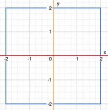
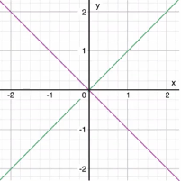

## 流程结构

### 1 Swift 支持的流程结构

- 循环结构： for、 for-in、while、do-while 
- 选择结构：if、switch

这些语句后面一定要添加上 `{}` 

### 2 for-in

```swift
for i in 1...3 {
  // TODO
}
```

如果不需要范围中的数值，可以用 `下划线_` 忽略

```
for _ in 1...3 {
  // TODO
}
```

### 3 Switch

**特性：**

- swicth 的变量不需要小括号
- case 支持字符串等内容
- case 结尾不需要 break
- case 后面必须有一个可执行语句 
- 必须要能处理所有情况
  - 在不能处理所有情况时必须要添加 default 语句

```swift
switch value {
    case "A":
        print("A")
    case "B":
        print("B")
    default:
        break
}
```

- 支持多条件匹配，条件用逗号`,` 隔开

```swift
var score = 57

switch score/10 {
case 0,1,2,3,4,5:
    print("不及格")
case 6:
    print("及格")
case 7, 8:
    print("良好")
case 9, 10:
    print("优秀")
default:
    print("输入错误")
}
```

- 支持范围匹配

```swift
var score = 57

switch score {
case 0..<60:
    print("不及格")
case 60..<70:
    print("及格")
case 70..<90:
    print("良好")
case 90...100:
    print("优秀")
default:
    print("输入错误")
}
```

- 支持匹配元组



```swift
// 判断一个点是否在坐标轴上或者给定的蓝色矩形区域内
let point = (1, 1)

switch point {
case (0, 0):
    print("在原点上")
case (_, 0):
    print("在X轴上")
case (0, _):
    print("在Y轴上")
case (-2...2, -2...2):
    print("在蓝色矩形内")
default:
    print("不在轴上也不在矩形内")
}
```

- 支持 case 数值绑定

```swift
// 在 case 匹配时，可以将 switch 中的值绑定给一个特定的常量或者变量，以便在 case 后面的语句中使用

let point = (10, 0)

switch point {
case (let x, 0):
    print("这个点在x坐标轴上，坐标值是\(x)")
case (0, var y):
    print("这个点在y坐标轴上，坐标值是\(y)")
case let (x, y):
    print("该点坐标为（\(x), \(y)）")
}
```

- switch 语句支持使用 where 来增加判断条件



```swift
// 判断一个点是否在紫线或者绿线上
let point = (10, -10)

switch point {
case let (x, y) where x == y:
    print("在绿线上（\(x), \(y)）")
case let (x, y) where x == -y:
    print("在紫线上（\(x), \(y)）")
default:
    print("不在任何一条线上")
}
```

- fallthrough

   执行完当前 case 后，会接着执行 fallthrough 后面的 case 或者 default 语句。

  fallthrough 后面的语句不能定义变量或者常量。

  ```swift
  let num = 43

  var str = "\(num) 是个在"

  switch num {
  case 0...50: 
      str += " 0 到 50 之间"
  case 51...100:
      str += " 50 到 100 之间"
      fallthrough
  default:
      str += "的整数"
  }

  print(str)
  ```

### 5.4 标签

标签可以明确指定退出哪个 for 循环。

```swift
out: for _ in 1...5 {
    for item in 1...10 {
        print("item=\(item)")
        if item == 8 {
            break out
        }
    }
}
```

